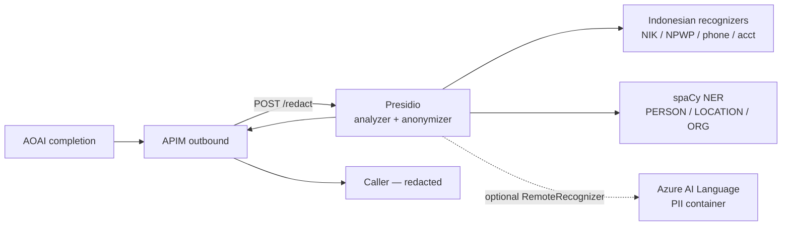

# M1.4 — Enterprise + BFSI policy patterns

## Why this page exists

The six policies in M1.2 — auth, content safety, semantic cache, token
limit, token metric, header routing — get you a **working AI gateway**.

But "working" and "production-grade for a regulated bank" are two
different bars. This page maps the gap. Each pattern below ships as
its own XML fragment in [`policies/`](https://github.com/adindabudi/azure-hybrid-ai-platform-workshop/tree/main/policies)
and is wired through the same automation script you ran in
[Apply policies](../facilitator-guide/apply-policies).

If you operate in **BFSI** (Bank Indonesia POJK 11/2022, OJK SEOJK
21/2017, Basel BCBS 239) or any other regulated industry — read all six
patterns. If you're a generalist enterprise — pick the four most
relevant and skip Pattern 6.

## Coverage matrix

| # | Pattern | Solves | XML | Auto-applied by |
| --- | --- | --- | --- | --- |
| 1 | **Backend circuit breaker** | AOAI keeps returning 429; APIM hammers it | [`circuit-breaker-aoai.json`](https://github.com/adindabudi/azure-hybrid-ai-platform-workshop/blob/main/policies/circuit-breaker-aoai.json) | `apply-apim-policies.sh` (default) |
| 2 | **Retry with exponential backoff** | Transient 429 / 5xx during burst | [`retry-with-exponential-backoff.xml`](https://github.com/adindabudi/azure-hybrid-ai-platform-workshop/blob/main/policies/retry-with-exponential-backoff.xml) | `apply-apim-policies.sh` (default) |
| 3 | **Audit trail to Event Hub** | Auditor needs every request, immutable, 5+ years | [`audit-trail-eventhub.xml`](https://github.com/adindabudi/azure-hybrid-ai-platform-workshop/blob/main/policies/audit-trail-eventhub.xml) | `--with-audit` |
| 4 | **Monthly token quota chargeback** | Finance needs a hard ceiling per cost center | [`quota-by-key-monthly.xml`](https://github.com/adindabudi/azure-hybrid-ai-platform-workshop/blob/main/policies/quota-by-key-monthly.xml) | `--with-quota` |
| 5 | **PII mask on response** | Bank data must not leak through completions | [`pii-mask-outbound.xml`](https://github.com/adindabudi/azure-hybrid-ai-platform-workshop/blob/main/policies/pii-mask-outbound.xml) | `--with-pii-mask` |
| 6 | **IP allow-list (branches/VPN)** | Only branch + Express Route egress can call | [`ip-filter-allowlist.xml`](https://github.com/adindabudi/azure-hybrid-ai-platform-workshop/blob/main/policies/ip-filter-allowlist.xml) | Manual (per environment) |
| 7 | **Weighted load balancer** | Blend PTU + Standard for cost optimisation | [`load-balancer-weighted.xml`](https://github.com/adindabudi/azure-hybrid-ai-platform-workshop/blob/main/policies/load-balancer-weighted.xml) | Reference only (extend `apply-apim-policies.sh`) |

## Pattern 1 — Backend circuit breaker (must-have for AOAI)

**Problem.** Azure OpenAI returns `429 Too Many Requests` with a
`Retry-After` header that can be **as large as 1 day** during sustained
quota exhaustion. Without a circuit breaker, APIM keeps forwarding —
your retry policy then compounds the load — and the priority pool's
failover never trips because the backend is technically "up", just
saying no.

**Solution.** Configure a circuit breaker on the **backend resource**
(not in policy XML — it's a property of the backend itself):

```json
"circuitBreaker": {
  "rules": [{
    "name": "aoai-trip-on-429-or-5xx",
    "failureCondition": {
      "count": 5, "interval": "PT1M",
      "statusCodeRanges": [
        { "min": 429, "max": 429 },
        { "min": 500, "max": 599 }
      ]
    },
    "tripDuration": "PT5M",
    "acceptRetryAfter": true
  }
}
```

Five 429s within a minute → circuit opens for 5 minutes (or whatever
`Retry-After` says, since `acceptRetryAfter: true`). During the open
period APIM short-circuits to `503` so the **pool** can route to the SLM
fallback instead.

**MS Learn explicitly recommends this for AOAI:** *"With Azure OpenAI
backends, implement circuit breaker rules to handle the 429 responses
and accept the Retry-After duration."*
([source](https://learn.microsoft.com/azure/api-management/backends#circuit-breaker)).

The workshop's `scripts/apply-apim-policies.sh` applies this by default
on `aoai-sea`. To verify:

```bash
az rest --method get \
  --url "https://management.azure.com$(az apim show -g $RG -n $APIM --query id -o tsv)/backends/aoai-sea?api-version=2024-05-01" \
  --query 'properties.circuitBreaker'
```

:::caution Not on Consumption SKU
Circuit breaker isn't supported on the **Consumption** tier. Workshop
uses Developer (Classic), so it's fine. If you port to Consumption you
lose this — fall back to in-policy `<retry>` only.
:::

## Pattern 2 — Retry with exponential backoff

**Problem.** Even with the circuit breaker in pattern 1, single
transient 429s and 502s should be retried before the user sees them.

**Solution.** Wrap `<forward-request>` in a `<retry>` block in the
**`<backend>`** section:

```xml
<backend>
  <retry condition="@(context.Response.StatusCode == 429 ||
                      (context.Response.StatusCode >= 500 &&
                       context.Response.StatusCode < 600))"
         count="5" interval="2" max-interval="30" delta="2"
         first-fast-retry="false">
    <forward-request buffer-request-body="true" />
  </retry>
</backend>
```

Wait time math (per
[MS Learn](https://learn.microsoft.com/azure/api-management/retry-policy#retry-wait-times)):

```
attempt 1: ~2s
attempt 2: ~4s
attempt 3: ~8s
attempt 4: ~16s
attempt 5: 30s (capped by max-interval)
```

**Always set `first-fast-retry="false"` on AOAI.** A 429 means "wait" —
never retry immediately. (Per Microsoft's
[Retry Storm antipattern](https://learn.microsoft.com/azure/architecture/antipatterns/retry-storm/)
guide, immediate retry on 429 amplifies the outage.)

`buffer-request-body="true"` is mandatory for chat-completions because
the request body is what we replay.

## Pattern 3 — Audit trail to Event Hubs

**Problem.** App Insights is not a regulator-grade audit sink:
- It's **sampled by default** (90-day retention).
- Bank audit retention is 5–10 years.
- App Insights is logically owned by the workload team, not a
  compliance team.

**Solution.** Mirror every request and response to an Event Hub via
`<log-to-eventhub>`. Event Hubs is **not affected by App Insights
sampling** ([source](https://learn.microsoft.com/azure/api-management/log-to-eventhub-policy)).
Capture from Event Hubs to immutable Storage / Azure Data Explorer for
long-term retention.

The fragment's structure (full file:
[`audit-trail-eventhub.xml`](https://github.com/adindabudi/azure-hybrid-ai-platform-workshop/blob/main/policies/audit-trail-eventhub.xml)):

```xml
<inbound>
  <log-to-eventhub logger-id="audit-eventhub-logger">
    @{ /* JSON: ts, requestId, sub, api, op, IP, ... */ }
  </log-to-eventhub>
</inbound>

<outbound>
  <log-to-eventhub logger-id="audit-eventhub-logger">
    @{ /* JSON: requestId, statusCode, tokens, durationMs, cacheHit */ }
  </log-to-eventhub>
</outbound>

<on-error>
  <log-to-eventhub logger-id="audit-eventhub-logger">
    @{ /* JSON: requestId, ERROR, source, reason, message */ }
  </log-to-eventhub>
</on-error>
```

**The 200 KB limit matters.** APIM truncates messages above 200 KB —
which means **don't log the full prompt or completion** in the audit
event unless you've sized your auditor's storage and got DLP sign-off.
The fragment in this repo deliberately logs **metadata only**.

**Apply with:**

```bash
EH_NAMESPACE=eh-audit-prod EH_HUB_NAME=apim-audit \
EH_CONNSTR='Endpoint=sb://...;SharedAccessKeyName=Send;SharedAccessKey=...;EntityPath=apim-audit' \
./scripts/apply-apim-policies.sh --with-audit
```

The script creates the `audit-eventhub-logger` and folds the three
`<log-to-eventhub>` blocks into the right sections of the bundle.

## Pattern 4 — Monthly token quota for chargeback

**Problem.** `llm-token-limit` with `tokens-per-minute` answers "how
fast can a tenant burn tokens?". Finance needs a different question:
**"how many tokens can this cost center spend per month?"**

**Solution.** A second `llm-token-limit` declared *after* the per-minute
throttle, but configured with a `token-quota` + `token-quota-period` pair
instead of `tokens-per-minute`. APIM evaluates the two policies in
declaration order — the first one to trip wins. This cleanly separates
**throttling** (per-minute, 429 on trip) from **chargeback ceiling**
(per-month, 403 on trip).

```xml
<llm-token-limit
    counter-key="@(context.Subscription.Id)"
    token-quota="2000000"
    token-quota-period="Monthly"
    estimate-prompt-tokens="false"
    remaining-quota-tokens-header-name="x-quota-remaining"
    retry-after-header-name="x-quota-retry-after-seconds" />
```

(`token-quota` is the budget for the period; `token-quota-period` accepts
`Hourly | Daily | Weekly | Monthly | Yearly` and resets on the UTC unit
boundary. See
[`llm-token-limit-policy` attributes](https://learn.microsoft.com/azure/api-management/llm-token-limit-policy#attributes).)

**Pair with chargeback dashboard.** The existing
`<llm-emit-token-metric>` (M2.1) already tags every metric with
`Subscription ID` **and splits prompt vs completion tokens into two
separate metric names** (`Prompt Tokens` and `Completion Tokens`,
plus the convenience aggregate `Total Tokens`). Compute per-tenant
monthly burn with the correct per-direction unit cost:

```kusto
// gpt-5-mini Global Standard PAYG, verified 2026-05-28 via Azure Retail
// Prices API: input USD 0.25 / 1M tok, output USD 2.00 / 1M tok.
// Re-pull before quoting; prices move. See README §Cost ceiling.
let price_in_per_token  = 0.25 / 1e6;
let price_out_per_token = 2.00 / 1e6;
customMetrics
| where timestamp > startofmonth(now())
| where name in ("Prompt Tokens", "Completion Tokens")
| extend sub = tostring(customDimensions["Subscription ID"])
| summarize tokens = sum(value) by sub, name
| extend cost_usd_estimate = case(
    name == "Prompt Tokens",     tokens * price_in_per_token,
    name == "Completion Tokens", tokens * price_out_per_token,
    real(null))
| summarize cost_usd = sum(cost_usd_estimate),
            prompt_tokens     = sumif(tokens, name == "Prompt Tokens"),
            completion_tokens = sumif(tokens, name == "Completion Tokens")
  by sub
| order by cost_usd desc
```

If your dashboard only joined `Total Tokens` (the aggregate metric),
swap in this blended approximation while you migrate to the
two-metric split — it assumes the workshop's typical 2:1 input:output
mix (1K in + 0.5K out per request) so it under-counts heavy-output
workloads:

```kusto
// Blended: $(1K * 0.25 + 0.5K * 2.0) / 1.5K tok = $0.000833 / 1K tok.
| extend cost_usd_estimate = tokens * 0.000833 / 1000
```

**Per-tenant variable ceilings.** A real chargeback system gives
different tenants different ceilings. Replace the static `2000000`
literal with a policy expression that looks the value up per
`Subscription.Id` from Cosmos DB or a Key Vault secret. The fragment's
header comment shows the expression skeleton.

The Microsoft AI playbook also lists this as the recommended
chargeback foundation — see
[GenAI gateway reference architecture → Tracking Consumption](https://learn.microsoft.com/ai/playbook/solutions/genai-gateway/reference-architectures/apim-based#5.1-tracking-consumption).

## Pattern 5 — PII mask on response

**Problem.** Even with content safety on the prompt, the **model's
response** can still echo or hallucinate PII (NIK, NPWP, account no.,
PAN). Whatever your downstream loggers see, it's their problem to
classify — unless you scrub at the gateway first.

**The trap to avoid.** It's tempting to chain `<find-and-replace>`
policies in `<outbound>` with regex-looking patterns. **Don't.** The
APIM `find-and-replace` policy does **substring replacement, not
regex** (per
[MS Learn](https://learn.microsoft.com/azure/api-management/find-and-replace-policy):
"finds a request or response substring and replaces it"). A pattern
like `(?<![0-9])[0-9]{16}(?![0-9])` is searched as a literal string,
matches nothing, and the gateway happily forwards every NIK in the
completion while the policy *looks* safe in code review. Worst kind of
safety bug.

**Solution.** Push detection into a small **Presidio orchestrator**
(`apps/presidio-pii`) running in the same AKS cluster. APIM does one
`<send-request>` per response; Presidio runs analyze + anonymize in one
shot and returns the redacted text.



**Two deployment modes (same image):**

| Mode | What runs | When to pick |
|---|---|---|
| **A — Presidio only** *(workshop default)* | spaCy `en_core_web_lg` NER + Indonesian regex recognizers | No Azure AI Language entitlement / no extra container |
| **B — Presidio + Azure AI Language container** | Mode A **plus** Language PII as a Presidio `RemoteRecognizer` | BFSI production track, you already have an S0 Language resource, you want enterprise-grade NER for `Person`/`Address`/`IBAN`/etc. |

This is the [Microsoft-documented integration pattern](https://microsoft.github.io/presidio/samples/python/integrating_with_external_services)
for combining Presidio with Azure AI Language. The orchestration layer
gives you composition (custom Indo recognizers merged with Language
hits in one pass), failover (Language outage → analyzer still returns
Indo + spaCy hits), and decoupling (APIM only knows about one
endpoint).

**The policy.** [`policies/pii-mask-outbound.xml`](https://github.com/adindabudi/azure-hybrid-ai-platform-workshop/blob/main/policies/pii-mask-outbound.xml)
is one `<send-request>` wrapped in `<choose>` guards:

```xml
<outbound>
  <choose>
    <!-- only mask completed JSON chat completions, not 4xx/5xx, not streaming -->
    <when condition="@(context.Response.StatusCode == 200
                        && context.Response.Headers.GetValueOrDefault("Content-Type","").Contains("application/json"))">

      <set-variable name="assistantText" value="@{ /* extract choices[].message.content */ }" />

      <send-request mode="new" response-variable-name="redactResponse"
                    timeout="5" ignore-error="true">
        <set-url>http://presidio-pii.presidio.svc.cluster.local/redact</set-url>
        <set-method>POST</set-method>
        <set-header name="Content-Type" exists-action="override">
          <value>application/json</value>
        </set-header>
        <set-body>@{
          return new JObject(new JProperty("text",
            (string)context.Variables["assistantText"])).ToString();
        }</set-body>
      </send-request>

      <!-- swap the redacted text back into the body and tag the response -->
      <set-body>@{ /* write redactResponse.text into choices[0].message.content */ }</set-body>
      <set-header name="x-pii-redactor" exists-action="override">
        <value>presidio</value>
      </set-header>
    </when>
  </choose>
</outbound>
```

**Failure posture.** `ignore-error="true"` makes Presidio fail-OPEN —
if Presidio is unreachable the original response goes through and
`x-pii-redactor: unavailable` flags it for SIEM alerting. Flip to
`false` if you require fail-CLOSED (gateway returns 502 when Presidio
is down). The trade-off is availability vs. compliance posture; pick
explicitly per regulator.

**Performance budget.** One Presidio call per response, ≤ 50 ms p50 on
a 500-token completion (spaCy NER dominates). Add `--language` Mode B
and the round-trip becomes ≤ 80 ms p50. Run two Presidio replicas
behind the cluster Service so a Pod restart doesn't blank the masking
layer.

**Apply with:**

```bash
# 1. Build the Presidio image into the workshop ACR
cd apps/presidio-pii && az acr build -r <acr> -t presidio-pii:latest .

# 2. Deploy Presidio (Mode A — no Language container)
kubectl apply -f apps/presidio-pii/deployment.yaml

# 3. (Optional) Mode B — add Azure AI Language container + secret
kubectl apply -f apps/language-pii-cpu/language-pii-cpu.yaml
kubectl create secret generic language-pii -n presidio \
  --from-literal=LANGUAGE_ENDPOINT=http://language-pii.language-pii.svc.cluster.local:5000 \
  --from-literal=LANGUAGE_KEY=any-string-the-container-ignores-it
kubectl rollout restart -n presidio deploy/presidio-pii

# 4. Attach the policy
./scripts/apply-apim-policies.sh --with-pii-mask
```

**References.**

- [Presidio — Adding recognizers](https://microsoft.github.io/presidio/analyzer/adding_recognizers)
- [Presidio sample — Integrating with external services](https://microsoft.github.io/presidio/samples/python/integrating_with_external_services)
- [Azure AI Language — PII container](https://learn.microsoft.com/azure/ai-services/language-service/personally-identifiable-information/how-to/use-containers)
- [APIM — `send-request` policy](https://learn.microsoft.com/azure/api-management/send-request-policy)
- [APIM — `find-and-replace` policy](https://learn.microsoft.com/azure/api-management/find-and-replace-policy) (the substring-only policy this pattern explicitly avoids for PII)

## Pattern 6 — IP allow-list (BFSI branches / Express Route)

**Problem.** Public APIM gateway is reachable from the entire internet.
For a bank, AI gateway calls should only originate from approved
networks: branch egress NATs, Express Route circuits, application VNet
NAT gateways.

**Solution.** `<ip-filter action="allow">` at API or operation scope.
Default-deny everything else.

```xml
<ip-filter action="allow">
  <address-range from="10.20.0.0" to="10.20.255.255" /> <!-- branches -->
  <address-range from="172.16.10.0" to="172.16.10.255" /> <!-- ER  -->
  <address>20.205.122.18</address>                      <!-- app VNet NAT -->
</ip-filter>
```

Forbidden caller gets `403 IPNotAllowed`. APIM ignores spoofed
`X-Forwarded-For` headers when the call hits the gateway directly
([source](https://learn.microsoft.com/azure/api-management/ip-filter-policy)).

**Apply at API scope, never global.** Global blocks the developer
portal too.

**Pen-test escape hatch.** Wrap with `<choose>` keyed on a named value
that an admin flips for the testing window:

```xml
<choose>
  <when condition="@({{pentest-window-active}} != "true")">
    <ip-filter action="allow"> ... </ip-filter>
  </when>
</choose>
```

## Pattern 7 — Weighted load balancer (cost blending)

**Problem.** The workshop ships a **priority** pool (P1=AOAI,
P2=SLM-fallback) — right when AOAI is the strict primary. Real
deployments often want the opposite: **blend traffic** across PTU and
Standard SKUs.

**Solution.** Same `aoai-pool` mechanism, but configure it with
weights instead of priorities. The pool composition (created manually
— the workshop's `apply-apim-policies.sh` does not currently expose a
flag for this; extend the script if you want it automated):

```
aoai-blended-pool (type=Pool):
  - aoai-ptu-sea       weight=70   (PTU — predictable cost)
  - aoai-standard-sea  weight=30   (Standard — burst capacity)
```

The policy XML stays trivial — just point at the pool:

```xml
<set-backend-service backend-id="aoai-blended-pool" />
```

The four routing patterns ([Backend pools](https://learn.microsoft.com/azure/api-management/backends#load-balanced-pool)):

- **Round-robin** (equal weights)
- **Weighted** (uneven weights, this pattern)
- **Priority** (failover, current workshop)
- **Session-aware** (sticky — pin a chat session to one backend; needed
  for streamed completions so deltas aren't re-routed mid-flight)

## How patterns combine

The recommended BFSI stack sits in this order in `<inbound>`:

```
1. ip-filter-allowlist                ← at the door
2. validate-jwt                       ← authn
3. llm-content-safety / shield-prompt ← prompt scrub
4. quota-by-key-monthly               ← chargeback ceiling (HARD)
5. llm-token-limit                    ← per-minute throttle (BURST)
6. llm-emit-token-metric              ← chargeback telemetry
7. llm-semantic-cache-lookup          ← serve from cache if possible
8. log-to-eventhub                    ← audit before forwarding
9. set-backend-service / route        ← pick the model
```

In `<backend>`:

```
1. retry  (count=5, exponential)
2. forward-request
```

In `<outbound>`:

```
1. llm-semantic-cache-store
2. find-and-replace × 6  (PII mask)
3. log-to-eventhub       (audit response)
```

In `<on-error>`:

```
1. log-to-eventhub  (audit failure)
2. return-response  (sanitised JSON)
```

## What this DOESN'T cover (and where to read next)

This module deliberately stops short of:

- **OAuth credential manager** for outbound auth to non-MI backends —
  see [Credentials overview](https://learn.microsoft.com/azure/api-management/credentials-overview).
- **Wildcard / unified API** for one APIM API serving N model
  providers (OpenAI + Gemini + Phi) — see the
  [Unified AI Gateway sample](https://github.com/Azure-Samples/APIM-Unified-AI-Gateway-Sample).
- **MCP-specific patterns** (PKCE, scopes) — covered in
  [M3](../mcp-secure-tool-access/intro).

## Next

[M2 — FinOps + Observability + Security](../finops-observability-security/intro)

## Reference

- [AI gateway capabilities](https://learn.microsoft.com/azure/api-management/genai-gateway-capabilities)
- [Backends — circuit breaker + load-balanced pool](https://learn.microsoft.com/azure/api-management/backends)
- [`retry` policy](https://learn.microsoft.com/azure/api-management/retry-policy)
- [`log-to-eventhub` policy](https://learn.microsoft.com/azure/api-management/log-to-eventhub-policy)
- [`find-and-replace` policy](https://learn.microsoft.com/azure/api-management/find-and-replace-policy)
- [`ip-filter` policy](https://learn.microsoft.com/azure/api-management/ip-filter-policy)
- [GenAI gateway reference architecture](https://learn.microsoft.com/ai/playbook/solutions/genai-gateway/reference-architectures/apim-based)
- [Retry Storm antipattern](https://learn.microsoft.com/azure/architecture/antipatterns/retry-storm/)
