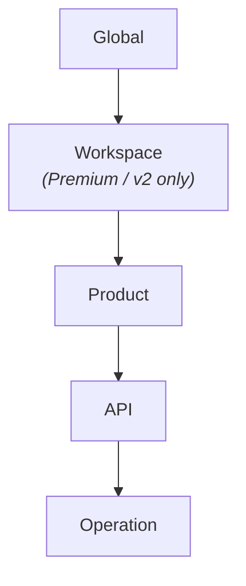

# M1.1 — Anatomy of a policy

## Why this page exists

Before you read the policy XML in M1.2, you need a mental model of **what
the file is doing, in plain English**. APIM policy XML looks intimidating,
but it's really just a **checklist with four columns** that runs on every
request.

If you already know what `<inbound>`, `<backend>`, `<outbound>`, and
`<on-error>` mean — skip ahead to [M1.2](./policies). Otherwise, spend
ten minutes here. It will save you hours of wrong-section debugging.

## The hotel-lobby analogy

Picture every API call as a guest walking into a hotel:

| Section | Hotel-lobby equivalent | Runs… | What you put here |
| --- | --- | --- | --- |
| `<inbound>` | The **front desk** — checks ID, takes payment, gives you a key | Before the request reaches the model | Auth, throttling, content scanning, routing |
| `<backend>` | The **bellhop walking your bags to the room** | The actual call to the AI model | Retry, set-backend, transform-before-send |
| `<outbound>` | **Housekeeping on the way out** — fluffs the pillows, restocks the minibar | After the model responds, before the caller sees it | Cache the response, mask PII, emit metrics, redact headers |
| `<on-error>` | The **manager** when something breaks | Only if anything above fails | Friendly error response, audit log, alert |

Concretely:

```xml
<policies>
    <inbound>     <!-- ① front desk: gate the request -->
        <base />
        <validate-jwt ... />
        <llm-token-limit ... />
    </inbound>
    <backend>     <!-- ② bellhop: call the AI -->
        <base />
        <forward-request />
    </backend>
    <outbound>    <!-- ③ housekeeping: fix up the response -->
        <base />
        <llm-semantic-cache-store ... />
    </outbound>
    <on-error>    <!-- ④ manager: handle blow-ups -->
        <base />
    </on-error>
</policies>
```

The order is **fixed**. Don't put `<llm-content-safety>` in `<outbound>` —
it scans the prompt, not the answer, so it belongs in `<inbound>`. Don't
put `<llm-semantic-cache-store>` in `<inbound>` — there's nothing to store
yet.

[`<base />`](https://learn.microsoft.com/azure/api-management/api-management-howto-policies#scopes)
inside any section means **"also run whatever the parent scope said for
this section"**. Always include it unless you have a specific reason not
to.

## When to use which section — one-line rules

These cover **95% of the policies you'll write**:

- Need to **block, throttle, or transform the request before it costs
  you anything**? → `<inbound>`
- Need to **wrap the call to the model** (retry, switch backend,
  buffer)? → `<backend>`
- Need to **edit, log, mask, or cache what the model returned**? →
  `<outbound>`
- Need to **handle a failure** the user shouldn't see raw? → `<on-error>`

Wrong-section is the most common policy bug. If your `<llm-emit-token-metric>`
isn't emitting, check the section: the policy schema only accepts
`<inbound>` (per
[MS Learn](https://learn.microsoft.com/azure/api-management/llm-emit-token-metric-policy#usage)).
APIM hooks the response read internally; you don't have to put anything
in `<outbound>` to get the token counts.

## Sub-anatomy: scopes (where the policy lives)

The same XML can be applied at five levels. Each level **inherits** the
one above via `<base />`.



| Scope | Right for | Workshop example |
| --- | --- | --- |
| **Global** | Things every API needs (CORS, baseline auth) | `validate-jwt` if 100% of traffic must be JWT-gated |
| **Product** | Per-tier policies (free / paid / internal) | Different `llm-token-limit` per product |
| **API** | All operations on one API behave the same | The workshop applies the bundle here on `api/openai` |
| **Operation** | One specific endpoint needs a different rule | Stricter limits on `chat/completions` than `embeddings` |

Workshop choice: **everything is at the API scope on `api/openai`**, because
we want one policy bundle to behave consistently across every chat
operation. Production deployments split things across scopes — you don't
have to.

## Sub-anatomy: expressions

Anything that looks like `@(...)` is a **C# expression** evaluated at
request time. Anything in `@{...}` is a multi-statement C# block. Both
can read from the always-available `context` object:

| Expression | What it gives you |
| --- | --- |
| `@(context.Subscription.Id)` | Calling subscription's id (the per-attendee key) |
| `@(context.Request.Headers.GetValueOrDefault("x-foo","bar"))` | Header value with default |
| `@(context.Request.IpAddress)` | Caller's IP |
| `@(context.Api.Id)` | Which API was hit |
| `@(context.Operation.Id)` | Which operation was hit |
| `@(context.Elapsed.TotalMilliseconds)` | (in `<outbound>`) End-to-end latency |
| `@(context.LastError.Message)` | (in `<on-error>`) The thing that broke |

The full surface is in
[Policy expressions](https://learn.microsoft.com/azure/api-management/api-management-policy-expressions)
— but you only ever need a dozen of them in practice.

## Sub-anatomy: named values

`{{my-secret}}` references an APIM **named value** — APIM's built-in
secret store, optionally backed by Key Vault. The workshop uses three:

| Named value | Used by |
| --- | --- |
| `{{aad-tenant-id}}` | `<validate-jwt>` openid-config URL |
| `{{aad-app-id}}` | `<validate-jwt>` required `aud` claim |
| `{{content-safety-host}}` / `{{content-safety-key}}` | Self-hosted Content Safety variant only |

The facilitator sets these once with `az apim nv create`. You'll never
hand-edit them as an attendee.

## Sub-anatomy: fragments

When the same chunk of XML repeats across many APIs (e.g. "the JWT block
plus the rate limit"), you put it in a **policy fragment** and pull it
in with `<include-fragment fragment-id="...">`. This workshop doesn't
use fragments — every policy is inline so you can read the whole flow
top-to-bottom — but you'll see them everywhere in production.

Reference: [Policy fragments](https://learn.microsoft.com/azure/api-management/policy-fragments).

## Reading order for the bundle

When you open
[`policies/workshop-llm-policy.xml`](https://github.com/adindabudi/azure-hybrid-ai-platform-workshop/blob/main/policies/workshop-llm-policy.xml)
in M1.2, read it like this:

1. **Start at `<inbound>`.** Top-down. Every line either rejects the
   request, modifies it, or counts something. The order matters — auth
   before content-safety before cache before token-limit before metric
   emit before routing.
2. **Skim `<backend>`.** It's almost empty in the workshop; the implicit
   `<forward-request />` does the actual call.
3. **Look at `<outbound>`.** Right now it's just the cache-store. In M2
   you'll add the PII mask and the audit log here.
4. **Note `<on-error>` is empty.** That's a deliberate choice — failures
   bubble up as APIM's default JSON error. In production you'd add
   audit logging here.

## What can go in `<on-error>`

This is the section most people forget exists. Only **15 specific
policies** are allowed inside it (per
[MS Learn](https://learn.microsoft.com/azure/api-management/api-management-error-handling-policies#policies-allowed-in-on-error)):

```
choose, set-variable, find-and-replace, return-response,
set-header, set-method, set-status, send-request,
send-one-way-request, log-to-eventhub, json-to-xml,
xml-to-json, limit-concurrency, mock-response, retry, trace
```

The most common BFSI use is **`<log-to-eventhub>`** — write every
failure to an immutable audit stream regardless of what broke.
Combined with `context.LastError.{Source,Reason,Section,Message}`, it
gives you a forensics trail your auditors can replay.

## What goes wrong if you ignore the section model

Three real failure modes (all of which cost a Friday afternoon to debug):

1. **Cache never hits** — you put `<llm-semantic-cache-store>` in
   `<inbound>` instead of `<outbound>`. The store needs the response;
   inbound runs before the response exists.
2. **Auth bypass on errors** — if `<validate-jwt>` is in `<inbound>` but
   your `<on-error>` returns a different response, you can leak
   internal info in the error body. Always sanitise error bodies in
   `<on-error>`.
3. **Token metric silently empty** — `<llm-emit-token-metric>` requires
   `metrics: true` on the API's App Insights diagnostic, AND the policy
   must be in `<inbound>` (where APIM can wrap the response read).
   Putting it in `<outbound>` is a no-op.

## The mental shortcut

> **Inbound = pre-flight checks. Backend = the flight. Outbound =
> baggage claim. On-error = lost luggage desk.**

Once that sticks, every policy file becomes readable.

## Next

[M1.2 — Walk through the AI-gateway policies](./policies)

## Reference

- [Policies in API Management — section model](https://learn.microsoft.com/azure/api-management/api-management-howto-policies#understanding-policy-configuration)
- [Error handling in API Management policies](https://learn.microsoft.com/azure/api-management/api-management-error-handling-policies)
- [Policy expressions](https://learn.microsoft.com/azure/api-management/api-management-policy-expressions)
- [Policy fragments](https://learn.microsoft.com/azure/api-management/policy-fragments)
- [Named values](https://learn.microsoft.com/azure/api-management/api-management-howto-properties)
