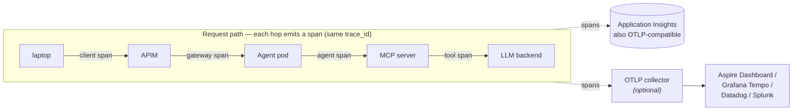
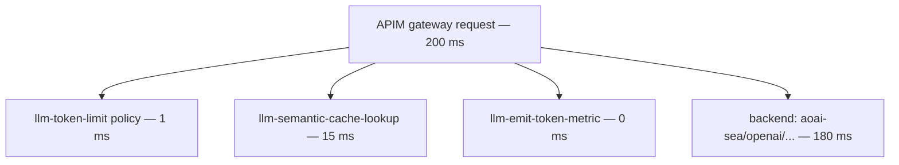

# M6 — One trace, user click → model response

## What you will accomplish

In this 45-minute module you will:

- Enable OpenTelemetry instrumentation in the MAF agent.
- Send spans to Application Insights AND to a parallel OTLP collector.
- Read one complete trace from gateway → agent → MCP tool → model.
- Run the **Aspire Dashboard** locally for the no-internet path.

## How the trace flows



Every hop emits a span with the same `trace_id`. App Insights stitches
them into one transaction.

## Prerequisites

- M4 done — you have a working MAF agent.
- M0 Python install — `microsoft-agents-a365-observability-extensions-agent-framework`
  and `azure-monitor-opentelemetry` are installed.
- The connection string for the workshop App Insights — from your M0
  handout (`APP_INSIGHTS_CONN_STRING`):

```bash
export APPLICATIONINSIGHTS_CONNECTION_STRING="$APP_INSIGHTS_CONN_STRING"
```

The string has the form
`InstrumentationKey=...;IngestionEndpoint=...;Region=...`.

## Step 1 — Instrument the agent

Add the highlighted lines to
`apps/agent-complaint-triage/agent.py`, **after the existing
`warnings.filterwarnings(...)` line** and **before** the
`from agent_framework ...` imports. Order matters — the OTel SDK has to
be configured before the agent framework loads, otherwise spans from
the first request go unrecorded.

```python {1-14}
import warnings
warnings.filterwarnings("ignore", message=".*is experimental.*")

from azure.monitor.opentelemetry import configure_azure_monitor
from microsoft_agents_a365.observability.core import configure
from microsoft_agents_a365.observability.extensions.agentframework import (
    AgentFrameworkInstrumentor,
)

configure(
    service_name="ComplaintTriage",
    service_namespace="hybrid-ai-workshop",
)
# Send the configured spans to App Insights via the Azure Monitor distro.
# Reads APPLICATIONINSIGHTS_CONNECTION_STRING from the environment.
configure_azure_monitor()
AgentFrameworkInstrumentor().instrument()

# ----- everything below is unchanged -----
import asyncio
import os
from agent_framework import Agent
from agent_framework.openai import OpenAIChatCompletionClient  # APIM = chat completions
...
```

Run it:

```bash
python apps/agent-complaint-triage/agent.py
```

Within ~60 seconds, **Application Insights → Transaction search** shows
a new trace with two spans:

- `Agent.run` (root) — your agent
- `chat.completions.create` (child) — the LLM call with full
  `gen_ai.*` semantic-convention attributes

If you also have a tool call (`classify_complaint`), it appears as a
third span.

:::caution PII risk
Set `AZURE_TRACING_GEN_AI_CONTENT_RECORDING_ENABLED=true` only in dev.
With it on, the full prompt and completion are captured as span
attributes — useful for debugging, dangerous for PII.
:::

## Step 2 — Add a parallel OTLP collector

App Insights is one backend. For an apples-to-apples comparison with
on-prem stacks, also export to OTLP.

Spin up a local Aspire Dashboard (Microsoft's OTLP visualizer):

```bash
docker run --rm -d \
  --name aspire-dashboard \
  -p 18888:18888 -p 18889:18889 \
  -e DOTNET_DASHBOARD_UNSECURED_ALLOW_ANONYMOUS=true \
  mcr.microsoft.com/dotnet/aspire-dashboard:latest
```

Open [http://localhost:18888](http://localhost:18888) — empty for now.

Update the agent to dual-export. Replace the M6 Step 1 instrumentation
block with:

```python
from azure.monitor.opentelemetry import configure_azure_monitor
from microsoft_agents_a365.observability.core import configure
from microsoft_agents_a365.observability.extensions.agentframework import (
    AgentFrameworkInstrumentor,
)
from opentelemetry import trace
from opentelemetry.sdk.trace.export import BatchSpanProcessor
from opentelemetry.exporter.otlp.proto.grpc.trace_exporter import (
    OTLPSpanExporter,
)

configure(
    service_name="ComplaintTriage",
    service_namespace="hybrid-ai-workshop",
)
configure_azure_monitor()       # Application Insights export

# Add OTLP export alongside the App Insights exporter.
trace.get_tracer_provider().add_span_processor(
    BatchSpanProcessor(OTLPSpanExporter(
        endpoint="http://localhost:18889",
        insecure=True,
    ))
)

AgentFrameworkInstrumentor().instrument()
```

Run the agent again. The trace appears in **both** App Insights *and*
the Aspire Dashboard.

## Step 3 — Walk through one full trace

Send a complaint that triggers all three components — agent + tool +
LLM — through the workshop gateway:

```bash
curl -sS \
  "${APIM_GATEWAY_URL}/openai/deployments/gpt-5-mini/chat/completions?api-version=2024-10-21" \
  -H "api-key: ${APIM_KEY}" \
  -H "Content-Type: application/json" \
  -H "x-trace-from: workshop" \
  -d '{"messages":[{"role":"user","content":"My card was swallowed at the ATM."}]}' \
  -o /dev/null
```

In **Application Insights → Transaction search**, filter by
`x-trace-from: workshop` to find your trace. You should see:



If your agent script triggered the request, you'll see an additional
parent transaction with `service.name=ComplaintTriage` joined by
`trace_id`.

## Step 4 — KQL: per-tool p95 latency

A useful dashboard query for the platform team. Run it in
**Application Insights** → **Monitoring** → **Logs** (Azure portal):

```kusto
dependencies
| where timestamp > ago(1h)
| where customDimensions["gen_ai.operation.name"] != ""
| extend
    op   = tostring(customDimensions["gen_ai.operation.name"]),
    model = tostring(customDimensions["gen_ai.request.model"])
| summarize
    count = count(),
    p50 = percentile(duration, 50),
    p95 = percentile(duration, 95),
    p99 = percentile(duration, 99)
    by op, model
| order by p95 desc
```

**Expected output** — one row per `(operation, model)` with latency
percentiles.

## Step 5 — Three benign warnings (talk-track them)

| Message | Meaning |
| --- | --- |
| `is_agent365_exporter_enabled() not enabled or token_resolver not set. Falling back to console exporter.` | Expected when you have no Agent365 token. App Insights export still works. |
| `Exporter is missing a valid region.` | Add `Region=southeastasia;` to your `APPLICATIONINSIGHTS_CONNECTION_STRING` to suppress. |
| `Attempting to instrument while already instrumented` + `ExperimentalWarning` | Idempotent. Cosmetic. Re-running the script does NOT double-wrap. |

The `opentelemetry-sdk 1.40.0 vs otlp-proto-grpc 1.41.1` pip resolver
warning is also cosmetic — both packages co-import and run together
cleanly.

## Step 6 — Vendor-neutrality

> "No agent code changes" is the whole pitch of OpenTelemetry — but a
> reader who has never swapped a backend can't picture what that
> actually looks like. Here's the proof: one 3-line refactor, then five
> real `.env` files.
>
> Everything in this section is grounded against the
> [OpenTelemetry Protocol Exporter specification](https://github.com/open-telemetry/opentelemetry-specification/blob/main/specification/protocol/exporter.md)
> and Microsoft Learn's ["Enable the OTLP Exporter"](https://learn.microsoft.com/azure/azure-monitor/app/opentelemetry-configuration#enable-the-otlp-exporter)
> guidance — see the **Reference** block at the end of the module for
> direct links.

### 6.1 — Make the endpoint env-driven (one-time, ~3 lines)

When you instantiate the OTLP gRPC exporter with no args, it auto-reads
`OTEL_EXPORTER_OTLP_ENDPOINT`, `OTEL_EXPORTER_OTLP_HEADERS`,
`OTEL_EXPORTER_OTLP_COMPRESSION`, and `OTEL_EXPORTER_OTLP_INSECURE`
from env (see the [OTel SDK env-var spec](https://github.com/open-telemetry/opentelemetry-specification/blob/main/specification/configuration/sdk-environment-variables.md)).
The wire protocol itself is locked by the **import path you choose**,
not by `OTEL_EXPORTER_OTLP_PROTOCOL` — so swap the import line if you
need HTTP/protobuf instead. Drop the hard-coded
`endpoint="http://localhost:18889"` from Step 2:

```python title="agent.py — instrumentation block (gRPC variant)"
from opentelemetry import trace
from opentelemetry.sdk.trace.export import BatchSpanProcessor
from opentelemetry.exporter.otlp.proto.grpc.trace_exporter import (
    OTLPSpanExporter,  # gRPC over HTTP/2 → port 4317
)

# No args → reads OTEL_EXPORTER_OTLP_ENDPOINT / _HEADERS / _INSECURE.
trace.get_tracer_provider().add_span_processor(
    BatchSpanProcessor(OTLPSpanExporter())
)
```

If you need HTTP/protobuf (the OTel **spec default** when you're using
full SDK auto-configuration), swap the import:

```python
from opentelemetry.exporter.otlp.proto.http.trace_exporter import (
    OTLPSpanExporter,  # HTTP/protobuf → port 4318, path /v1/traces
)
```

That's it. Everything below is a `.env` swap.

### 6.2 — Five drop-in destinations

Pick the file that matches your destination, `source` it, restart the
agent. No re-deploy, no rebuild. (Endpoints below are the **gRPC port
4317** variants, matching the import in 6.1.)

```bash title=".env.aspire (local OSS — what you ran in Step 2)"
OTEL_EXPORTER_OTLP_ENDPOINT=http://localhost:18889
OTEL_EXPORTER_OTLP_INSECURE=true
```

```bash title=".env.tempo (Grafana Tempo, self-hosted on AKS)"
OTEL_EXPORTER_OTLP_ENDPOINT=http://tempo.observability.svc.cluster.local:4317
OTEL_EXPORTER_OTLP_INSECURE=true   # TLS terminates at the AKS ingress
```

```bash title=".env.jaeger (Jaeger all-in-one, dev cluster)"
OTEL_EXPORTER_OTLP_ENDPOINT=http://jaeger-collector.observability.svc.cluster.local:4317
OTEL_EXPORTER_OTLP_INSECURE=true
```

```bash title=".env.honeycomb (Honeycomb SaaS — native OTLP)"
OTEL_EXPORTER_OTLP_ENDPOINT=https://api.honeycomb.io:443
OTEL_EXPORTER_OTLP_HEADERS=x-honeycomb-team=${HONEYCOMB_API_KEY}
```

```bash title=".env.newrelic (New Relic SaaS — native OTLP)"
OTEL_EXPORTER_OTLP_ENDPOINT=https://otlp.nr-data.net:4317
OTEL_EXPORTER_OTLP_HEADERS=api-key=${NEW_RELIC_LICENSE_KEY}
```

```bash title=".env.datadog (Datadog Agent OTLP receiver, sidecar)"
# Datadog's hosted endpoint does NOT accept OTLP directly. Run the
# Datadog Agent as a DaemonSet or sidecar with its OTLP receiver enabled
# via DD_OTLP_CONFIG_RECEIVER_PROTOCOLS_GRPC_ENDPOINT=0.0.0.0:4317 and
# point at it. The Agent forwards to Datadog using DD_API_KEY itself,
# so no auth headers are needed from your agent process.
OTEL_EXPORTER_OTLP_ENDPOINT=http://localhost:4317
OTEL_EXPORTER_OTLP_INSECURE=true
```

Splunk, Elastic, and Lightstep all follow the same pattern: an HTTPS
endpoint plus a per-vendor header in `OTEL_EXPORTER_OTLP_HEADERS`. Check
each vendor's OTLP page for the exact header name.

### 6.3 — Dual-export (App Insights *and* a third party at the same time)

`add_span_processor` is additive, so you can fan-out the same trace
without choosing a winner — Microsoft's own Distros explicitly support
[exporting to an OTLP endpoint **alongside** Azure Monitor](https://learn.microsoft.com/azure/azure-monitor/app/opentelemetry-configuration#enable-the-otlp-exporter)
(this snippet is adapted directly from that page):

```python title="agent.py — dual-export"
import os
from azure.monitor.opentelemetry import configure_azure_monitor
from opentelemetry import trace
from opentelemetry.sdk.trace.export import BatchSpanProcessor
from opentelemetry.exporter.otlp.proto.grpc.trace_exporter import (
    OTLPSpanExporter,
)

# App Insights export — reads APPLICATIONINSIGHTS_CONNECTION_STRING.
configure_azure_monitor()

# Honeycomb (or any OTLP receiver) — additive, same trace_id.
trace.get_tracer_provider().add_span_processor(
    BatchSpanProcessor(OTLPSpanExporter(
        endpoint="https://api.honeycomb.io:443",
        headers={"x-honeycomb-team": os.environ["HONEYCOMB_API_KEY"]},
    ))
)
```

The same `trace_id` lands in both backends, so you can compare query
ergonomics side-by-side before cutting over.

:::caution Microsoft's stance on third-party OTLP destinations
The MS Learn page that documents this pattern adds: *"The OTLP Exporter
is shown for convenience only. Microsoft doesn't officially support the
OTLP Exporter or any components or third-party experiences downstream of
it."* You still own ingestion costs, vendor support tickets, and PII
handling in the third-party backend.
:::

### 6.4 — Three gotchas to call out

| Gotcha | Symptom | Fix |
| --- | --- | --- |
| gRPC vs HTTP/proto port mismatch | `Failed to export batch... DEADLINE_EXCEEDED` | Pick **one** import path. gRPC = `opentelemetry.exporter.otlp.proto.grpc.trace_exporter` on `:4317`. HTTP/protobuf = `opentelemetry.exporter.otlp.proto.http.trace_exporter` on `:4318`, path `/v1/traces`. The wire protocol is fixed by the import, not by `OTEL_EXPORTER_OTLP_PROTOCOL`. |
| `insecure=True` against an `https://` endpoint | `transport: authentication handshake failed` / `SSL_ERROR_*` | Drop `OTEL_EXPORTER_OTLP_INSECURE=true`. Set it only for plaintext `http://` endpoints (local Collectors, in-cluster sidecars). |
| `OTEL_EXPORTER_OTLP_HEADERS` parsed as JSON | Auth silently fails, traces 401 at the vendor | Format is **W3C Baggage**, i.e. comma-separated `key=value` ([OTel spec](https://github.com/open-telemetry/opentelemetry-specification/blob/main/specification/protocol/exporter.md#specifying-headers-via-environment-variables)). Example: `key1=v1,key2=v2`. Semi-colons are not supported. |

The pitch holds: the agent code from Step 2 is unchanged across all five
destinations above. The only thing that moves is the `.env` file.

## What you just built

- A trace that connects user request → gateway policy → agent →
  tool → LLM, all under one `trace_id`.
- A dashboard query that shows per-tool latency percentiles.
- A vendor-neutral OTLP path that can target Aspire today and Splunk
  tomorrow.

## Reference

- [Azure Monitor OpenTelemetry distro](https://learn.microsoft.com/azure/azure-monitor/app/opentelemetry-enable) — primary install + onboarding
- [Enable the OTLP Exporter (Azure Monitor)](https://learn.microsoft.com/azure/azure-monitor/app/opentelemetry-configuration#enable-the-otlp-exporter) — official Microsoft sample for the dual-export pattern in §6.3
- [Microsoft OpenTelemetry Distro overview](https://learn.microsoft.com/microsoft-agent-365/developer/microsoft-opentelemetry) — explicit multi-backend support (Azure Monitor + Datadog / Grafana / New Relic + A365)
- [OpenTelemetry Protocol Exporter specification](https://github.com/open-telemetry/opentelemetry-specification/blob/main/specification/protocol/exporter.md) — authoritative source for endpoint, headers (W3C Baggage), protocol, and port defaults
- [OpenTelemetry SDK environment-variable specification](https://github.com/open-telemetry/opentelemetry-specification/blob/main/specification/configuration/sdk-environment-variables.md) — full `OTEL_*` env-var catalogue
- [OpenTelemetry GenAI semantic conventions](https://opentelemetry.io/docs/specs/semconv/gen-ai/) — names used in the §4 KQL query
- [Aspire Dashboard standalone mode](https://learn.microsoft.com/dotnet/aspire/fundamentals/dashboard/standalone) — local OTLP target used in §2

## Next

[Wrap-up](../wrap-up)
