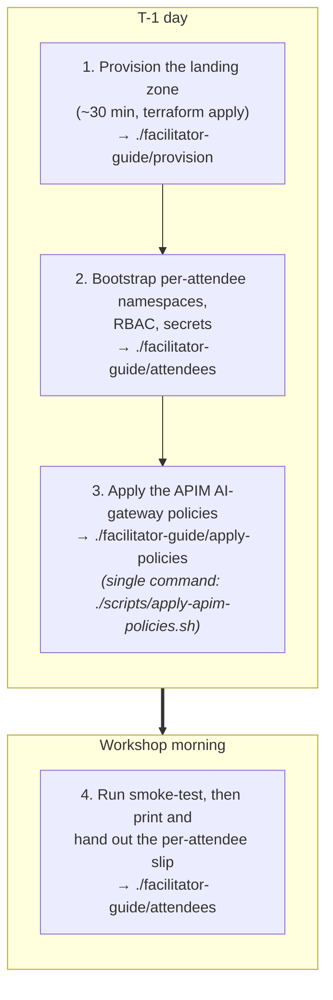

# Facilitator Guide

This section is for **workshop admins** running the landing zone, not
for attendees. The materials assume you have:

- Owner (or Contributor + RBAC Administrator) on the workshop resource
  group.
- Local Terraform 1.9+, Azure CLI 2.61+, `kubectl`, `jq`.
- Permission to register Microsoft Entra apps in the workshop tenant.

If you are an attendee, ignore this section and start at
[M0 — Setup](../00-intro/setup.md).

## End-to-end flow

Each attendee then follows [M0 — Setup](../00-intro/setup.md) using the slip
of paper you handed them.

## What goes where

| Concern | Page |
| --- | --- |
| `terraform apply`, regions, what gets deployed | [Provision the landing zone](./provision.md) |
| Per-attendee namespaces, secrets, handout printing | [Provision attendees](./attendees.md) |
| APIM API import, backends, MI role assignments, policy XML | [Apply the AI-gateway policies](./apply-policies.md) |

## Reuse for self-paced learners

If you are running M0–M6 alone on your own subscription, follow the
facilitator guide in order, then run the attendee labs against your own
gateway. The env vars you would normally hand out (`APIM_GATEWAY_URL`,
`APIM_KEY`, etc.) come from `terraform output` plus
`./scripts/print-attendee-handout.sh 01` after the bootstrap completes.
