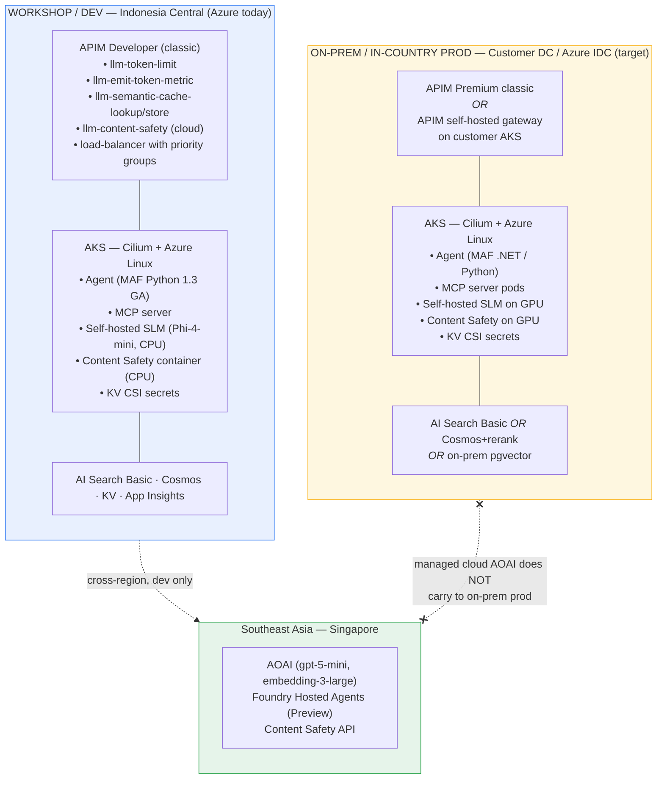

# Hybrid AI Platform Workshop

Build a production-grade AI gateway and agent platform that spans Azure
managed services and on-prem (or in-country) Azure Kubernetes Service.

## Who this workshop is for

You have shipped at least one application with the Azure OpenAI SDK, or
built an agent with LangGraph / LangChain. You are comfortable on the
command line with `kubectl`, `terraform`, and `az`. You want to move beyond
"call the SDK from the app" and build the gateway, observability,
guardrails, and agent runtime that production demands.

## What you will build

By the end of the day, you will have:

1. An **AI Gateway** (Azure API Management) fronting two model backends —
   one managed (Azure OpenAI) and one self-hosted (Phi-4-mini on AKS) —
   with token limits, semantic cache, content-safety scanning, priority-
   based load balancing, and per-tenant rate limits.
2. Live **token-cost telemetry** flowing into Application Insights, broken
   down by subscription, API, operation, model, and client IP.
3. A **multi-runtime agent** built with Microsoft Agent Framework that hits
   four different backends — managed cloud, self-hosted SLM, LiteLLM, and
   the architect's laptop — switched by a single environment variable.
4. A reproducible **OpenTelemetry** pipeline showing one trace per user
   request, end-to-end: laptop → gateway → agent → MCP tool → model.
5. A **migration playbook** for moving existing LangGraph / LangChain
   agents under this gateway with three lines of instrumentation code.

## How the day is structured

| Time | Module | Length |
| --- | --- | --- |
| 09:00 | **M0** — Setup and architecture briefing | 30 min |
| 09:30 | **M1** — AI Gateway foundations | 75 min |
| 10:45 | Break | 15 min |
| 11:00 | **M2** — FinOps, observability, and security | 60 min |
| 12:00 | Lunch | 60 min |
| 13:00 | **M3** — Model Context Protocol through the gateway | 45 min |
| 13:45 | **M4** — Agent Framework: local, cloud, hybrid | 75 min |
| 15:00 | Break | 15 min |
| 15:15 | **M5** — Evaluation and local red teaming | 45 min |
| 16:00 | **M6** — OpenTelemetry end-to-end | 45 min |
| 16:45 | Wrap-up and Q&A | 15 min |

## Service residency reality (Indonesia Central, May 2026)

This workshop deploys to **Azure Indonesia Central (IDC)** with a
cross-region fan-out to **Southeast Asia (SEA / Singapore)** for the
services that are not yet in IDC. The decision matrix below is the same
one you will use when planning a real deployment in any region with
partial service coverage.

| Capability | Available in IDC | Available in SEA | Strategy used here |
| --- | --- | --- | --- |
| APIM Developer / Premium **classic** | ✅ | ✅ | Workshop = Developer. Prod = Premium classic, or self-hosted gateway on customer AKS. |
| APIM **v2** tiers | ❌ | ✅ | Concept only — not deployable in IDC. |
| AKS | ✅ | ✅ | Workshop AKS in IDC. Agents, MCP servers, SLM, self-hosted Content Safety. |
| Azure AI Search | ✅ Basic only (no semantic ranker) | ✅ all features | Cosmos DB vector + semantic reranker (Preview) as the in-IDC workaround. |
| Cosmos DB vector + semantic reranker (Preview) | ✅ | ✅ | In-IDC reranking option. |
| Azure OpenAI | ❌ | ✅ | Cloud-for-dev only. On-prem path = self-hosted SLM in AKS. |
| Foundry Hosted Agents | ❌ | ✅ | Optional demo — not in IDC. |
| Content Safety **API** | ❌ | ✅ | Cloud-only. See M2 for the container path. |
| Content Safety **container** | ✅ (on AKS) | ✅ | The in-IDC path for content scanning. |

:::tip
The residency story in this workshop is universal — every region with
partial Azure coverage runs into the same trade-offs. Substitute "IDC"
with your target region and the architecture decisions carry over.
:::

## Two architectures, side by side

## How to use this site

Each module has:

- A short **overview page** with learning goals and prerequisites.
- One or more **hands-on labs** with numbered procedures, copy-pasteable
  commands, and explicit verification steps after every action.
- A **"What you just built"** section that explains the design choices.

You can run every lab on your laptop against the shared workshop landing
zone, or fork [the repo](https://github.com/adindabudi/azure-hybrid-ai-platform-workshop)
and redeploy the whole stack in your own Azure subscription.

:::info Facilitators
If you're running the workshop for others, jump to the
[Facilitator Guide](./90-facilitator-guide/index.md) for landing zone provisioning,
attendee bootstrapping, and policy application. The attendee path
(M0–M6) assumes the landing zone is already up and you've handed each
attendee a printed connection slip.
:::

Ready? Start with [M0 — Setup](./intro/setup).
